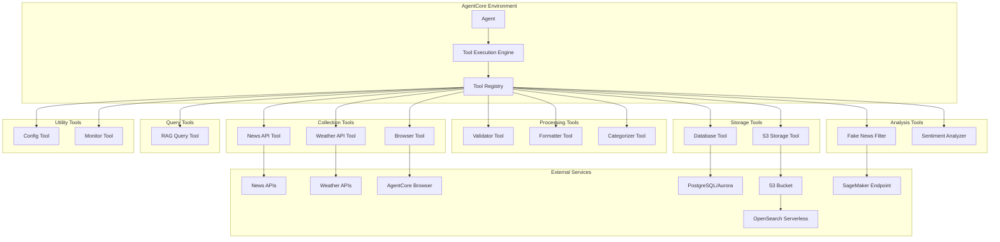

# Design Document

## Overview

The StrandsAgents Data Pipeline is a comprehensive data collection and processing system designed for deployment on Bedrock AgentCore. The system implements a multi-stage pipeline that collects data from various sources (APIs and web scraping), processes and standardizes the data, stores it in both relational and object storage, and provides intelligent querying capabilities through RAG (Retrieval-Augmented Generation).

The architecture follows a modular, event-driven design that supports both scheduled autonomous operation and on-demand execution. Optional components provide advanced features like fake news filtering, sentiment analysis, and enhanced metadata generation for improved search capabilities.

## Architecture

### High-Level Tool-Based Architecture



### Tool-Based Architecture

The system is organized as a collection of modular tools that the agent can invoke:

1. **Core Data Collection Tools**: API and Browser-based data collection
2. **Data Processing Tools**: Transformation, validation, and standardization
3. **Storage Tools**: Database and S3 storage operations
4. **Analysis Tools**: Optional features like fake news filtering and sentiment analysis
5. **Query Tools**: RAG-based intelligent querying
6. **Utility Tools**: Configuration, monitoring, and maintenance operations

Each tool is designed as an independent, reusable component with standardized interfaces, making it easy to add new tools or modify existing ones without affecting the overall system.

### Project Structure

```
src/
├── agents/                     # Agent layer
│   └── data_collector_agent.py
├── tools/                      # Tool implementations (SOLID principles applied here)
│   ├── collectors/            # Data collection tools
│   │   ├── base_collector.py  # Abstract base class
│   │   ├── news_collector.py  # News API collector
│   │   ├── weather_collector.py # Weather API collector
│   │   └── web_collector.py   # Web scraping collector
│   ├── processors/            # Data processing tools
│   │   ├── base_processor.py  # Abstract base class
│   │   ├── validator.py       # Data validation
│   │   ├── formatter.py       # Data formatting
│   │   └── categorizer.py     # Data categorization
│   ├── storage/              # Storage tools
│   │   ├── base_storage.py    # Abstract base class
│   │   ├── database_storage.py # Database operations
│   │   └── s3_storage.py      # S3 operations
│   ├── analyzers/            # Analysis tools (optional)
│   │   ├── fake_news_filter.py
│   │   └── sentiment_analyzer.py
│   ├── query/                # Query tools
│   │   └── rag_query.py       # RAG query processor
│   └── shared/               # Shared utilities within tools
│       ├── exceptions.py     # Tool-specific exceptions
│       ├── logger.py         # Logging utilities
│       └── config.py         # Configuration management
├── agentcore.py              # Main entry point
└── tools.py                   # Tool function definitions with @tool decorators
```

## Core Components

### 1. Agent Layer

#### StrandsDataPipelineAgent

```python
from typing import Any, Dict, List, Optional
from presentation.tools.collection_tools import CollectionTools
from presentation.tools.processing_tools import ProcessingTools
from presentation.tools.storage_tools import StorageTools
from presentation.tools.analysis_tools import AnalysisTools
from presentation.tools.query_tools import QueryTools
from infrastructure.config.dependency_injection import DIContainer

# Data Collection Tools (Following DIP and SRP)
@tool
def collect_news_data(countries: List[str], category: str = "general") -> Dict[str, Any]:
    """
    Collect news data from free APIs for specified countries

    Args:
        countries: List of country codes (e.g., ['us', 'jp', 'uk'])
        category: News category (general, business, technology, sports, health)

    Returns:
        Dictionary containing collected news articles and metadata
    """
    # Dependency injection - depends on abstraction, not concrete implementation
    container = DIContainer.get_instance()
    collection_use_case = container.get_use_case('collect_data')

    # Create request DTO
    request = CollectionRequest(
        countries=countries,
        category=category,
        data_type='news'
    )

    # Execute use case
    result = collection_use_case.execute(request)

    # Map domain result to tool response
    return CollectionMapper.to_tool_response(result)

@tool
def collect_weather_data(countries: List[str], cities: Optional[List[str]] = None) -> Dict[str, Any]:
    """
    Collect weather data from free APIs for specified countries

    Args:
        countries: List of country codes
        cities: List of cities (optional, defaults to capitals)

    Returns:
        Dictionary containing weather data for specified locations
    """
    collector = WeatherAPICollector()
    return collector.collect_weather(countries, cities)

@tool
def collect_web_data(urls: List[str], data_type: str, selectors: Optional[Dict] = None) -> Dict[str, Any]:
    """
    Collect data from web sources using AgentCore Browser

    Args:
        urls: List of URLs to scrape
        data_type: Type of data to collect (blog, social_media, news)
        selectors: CSS selectors for data extraction

    Returns:
        Dictionary containing scraped web data formatted to API structure
    """
    collector = BrowserCollector()
    return collector.collect_web_data(urls, data_type, selectors)

# Data Processing Tools
@tool
def validate_data(data: List[Dict], schema_type: str) -> Dict[str, Any]:
    """
    Validate collected data against predefined schemas

    Args:
        data: List of data objects to validate
        schema_type: Schema type (news, weather, social_media)

    Returns:
        Dictionary containing validation results and cleaned data
    """
    validator = DataValidator()
    return validator.validate(data, schema_type)

@tool
def format_data(raw_data: List[Dict], source_type: int, country: str = "us") -> Dict[str, Any]:
    """
    Format data to standardized NEWS API structure

    Args:
        raw_data: Raw data to format
        source_type: Source type (0 for API, 1 for Browser)
        country: Country code for timezone handling

    Returns:
        Dictionary containing formatted data
    """
    formatter = DataFormatter()
    return formatter.format_data(raw_data, source_type, country)

@tool
def categorize_data(data: List[Dict], use_ai_categorization: bool = False) -> Dict[str, Any]:
    """
    Categorize data into appropriate categories

    Args:
        data: Data to categorize
        use_ai_categorization: Whether to use AI for advanced categorization

    Returns:
        Dictionary containing categorized data
    """
    categorizer = DataCategorizer()
    return categorizer.categorize(data, use_ai_categorization)

# Storage Tools
@tool
def store_in_database(categorized_data: Dict[str, List[Dict]]) -> Dict[str, Any]:
    """
    Store categorized data in PostgreSQL/Aurora database

    Args:
        categorized_data: Data organized by categories

    Returns:
        Dictionary containing storage results and statistics
    """
    storage = DatabaseStorage()
    return storage.store_categorized_data(categorized_data)

@tool
def store_in_s3(data: List[Dict], metadata: Optional[Dict] = None) -> Dict[str, Any]:
    """
    Store JSON data in S3 with prefix structure (country/year/month/day/data-source-name/)

    Args:
        data: Data to store in S3
        metadata: Optional metadata for RAG enhancement

    Returns:
        Dictionary containing S3 storage results and paths
    """
    storage = S3Storage()
    return storage.store_data(data, metadata)

# Analysis Tools (Optional)
@tool
def filter_fake_news(content: str, threshold: float = 0.7) -> Dict[str, Any]:
    """
    Filter content for fake news using SageMaker endpoint

    Args:
        content: Text content to analyze
        threshold: Credibility threshold (0.0 to 1.0)

    Returns:
        Dictionary containing credibility score and filter decision
    """
    filter_tool = FakeNewsFilter()
    return filter_tool.analyze_content(content, threshold)

@tool
def analyze_sentiment(content: str) -> Dict[str, Any]:
    """
    Analyze sentiment of text content

    Args:
        content: Text content to analyze

    Returns:
        Dictionary containing sentiment scores and classifications
    """
    analyzer = SentimentAnalyzer()
    return analyzer.analyze_sentiment(content)

# Query Tools
@tool
def query_rag(query: str, max_results: int = 5) -> Dict[str, Any]:
    """
    Process natural language queries using RAG (Retrieval-Augmented Generation)

    Args:
        query: Natural language query
        max_results: Maximum number of results to return

    Returns:
        Dictionary containing generated response and source citations
    """
    rag_query = RAGQuery()
    return rag_query.process_query(query, max_results)
```

#### agent.py - Main Agent Entry Point

```python
from typing import Dict, Any, List
from shared.logging.logger_factory import LoggerFactory
from infrastructure.config.dependency_injection import DIContainer
from application.use_cases.collect_data_use_case import CollectDataUseCase
from application.use_cases.process_data_use_case import ProcessDataUseCase
from application.use_cases.store_data_use_case import StoreDataUseCase
from application.use_cases.query_data_use_case import QueryDataUseCase
from application.dto.collection_request import CollectionRequest
from presentation.mappers.collection_mapper import CollectionMapper
from shared.exceptions.application_exceptions import ApplicationException

class StrandsDataPipelineAgent:
    """
    Main Strands Agent for data pipeline operations
    Follows Single Responsibility Principle - orchestrates use cases
    """

    def __init__(self, di_container: DIContainer):
        self.agent_id = "strands-data-pipeline"
        self.agent_name = "Strands Data Pipeline Agent"
        self.logger = LoggerFactory.create_logger(__name__)
        self._di_container = di_container

        # Dependency injection - depends on abstractions
        self._collect_use_case = di_container.get_use_case('collect_data')
        self._process_use_case = di_container.get_use_case('process_data')
        self._store_use_case = di_container.get_use_case('store_data')
        self._query_use_case = di_container.get_use_case('query_data')

    def execute_data_pipeline(self, config: Dict[str, Any]) -> Dict[str, Any]:
        """
        Execute complete data pipeline workflow using available tools

        Args:
            config: Pipeline configuration dictionary

        Returns:
            Dictionary containing pipeline execution results
        """
        pipeline_results = {}

        try:
            # Step 1: Data Collection
            collected_data = []

            if config.get("collect_news", True):
                news_result = collect_news_data(
                    countries=config.get("countries", ["us", "jp"]),
                    category=config.get("news_category", "general")
                )
                pipeline_results["news_collection"] = news_result
                if news_result.get("success"):
                    collected_data.extend(news_result.get("articles", []))

            if config.get("collect_weather", True):
                weather_result = collect_weather_data(
                    countries=config.get("countries", ["us", "jp"]),
                    cities=config.get("cities")
                )
                pipeline_results["weather_collection"] = weather_result
                if weather_result.get("success"):
                    collected_data.extend(weather_result.get("weather_reports", []))

            if config.get("collect_web_data", False) and config.get("web_urls"):
                web_result = collect_web_data(
                    urls=config.get("web_urls", []),
                    data_type=config.get("web_data_type", "blog"),
                    selectors=config.get("web_selectors")
                )
                pipeline_results["web_collection"] = web_result
                if web_result.get("success"):
                    collected_data.extend(web_result.get("scraped_data", []))

            # Step 2: Data Processing
            if collected_data:
                # Validation
                validation_result = validate_data(
                    data=collected_data,
                    schema_type="news"
                )
                pipeline_results["validation"] = validation_result

                if validation_result.get("success"):
                    valid_data = validation_result.get("valid_data", [])

                    # Formatting
                    format_result = format_data(
                        raw_data=valid_data,
                        source_type=0,  # Mixed sources
                        country=config.get("primary_country", "us")
                    )
                    pipeline_results["formatting"] = format_result

                    if format_result.get("success"):
                        formatted_data = format_result.get("formatted_data", [])

                        # Categorization
                        categorize_result = categorize_data(
                            data=formatted_data,
                            use_ai_categorization=config.get("use_ai_categorization", False)
                        )
                        pipeline_results["categorization"] = categorize_result

                        # Step 3: Storage
                        if categorize_result.get("success"):
                            categorized_data = categorize_result.get("categorized_data", {})

                            # Database storage
                            if config.get("store_in_database", True):
                                db_result = store_in_database(categorized_data)
                                pipeline_results["database_storage"] = db_result

                            # S3 storage
                            if config.get("store_in_s3", True):
                                s3_result = store_in_s3(
                                    data=formatted_data,
                                    metadata=config.get("s3_metadata")
                                )
                                pipeline_results["s3_storage"] = s3_result

                        # Step 4: Optional Analysis
                        if config.get("enable_fake_news_filter", False):
                            for item in formatted_data:
                                if item.get("content"):
                                    filter_result = filter_fake_news(
                                        content=item["content"],
                                        threshold=config.get("fake_news_threshold", 0.7)
                                    )
                                    item["fake_news_score"] = filter_result

                        if config.get("enable_sentiment_analysis", False):
                            for item in formatted_data:
                                if item.get("content"):
                                    sentiment_result = analyze_sentiment(item["content"])
                                    item["sentiment"] = sentiment_result

            return {
                "success": True,
                "message": "Data pipeline executed successfully",
                "results": pipeline_results,
                "total_items_processed": len(collected_data)
            }

        except Exception as e:
            self.logger.error(f"Pipeline execution failed: {str(e)}")
            return {
                "success": False,
                "message": f"Pipeline execution failed: {str(e)}",
                "results": pipeline_results
            }

    def query_data(self, query: str, max_results: int = 5) -> Dict[str, Any]:
        """
        Query stored data using RAG

        Args:
            query: Natural language query
            max_results: Maximum number of results

        Returns:
            Query results with generated response
        """
        return query_rag(query, max_results)

# Entry point for AgentCore deployment
def create_agent() -> StrandsDataPipelineAgent:
    """Factory function to create the Strands Agent"""
    return StrandsDataPipelineAgent()
```

### 1. Data Collection Tools

#### News API Collector Tool

```python
class NewsAPICollectorTool(StrandsAgentTool):
    def __init__(self):
        super().__init__(
            tool_name="collect_news_data",
            description="Collect news data from free APIs for specified countries"
        )

    def get_input_schema(self) -> Dict[str, Any]:
        return {
            "type": "object",
            "properties": {
                "countries": {
                    "type": "array",
                    "items": {"type": "string"},
                    "description": "List of country codes (e.g., ['us', 'jp', 'uk'])"
                },
                "category": {
                    "type": "string",
                    "description": "News category (optional)",
                    "enum": ["general", "business", "technology", "sports", "health"]
                }
            },
            "required": ["countries"]
        }

    def execute(self, countries: List[str], category: str = "general", **kwargs) -> ToolResponse:
        """Collect news data from NEWS API for specified countries"""
        try:
            collected_data = []
            for country in countries:
                # Implementation for NEWS API calls
                news_data = self._fetch_news_from_api(country, category)
                collected_data.extend(news_data)

            return ToolResponse(
                success=True,
                message=f"Successfully collected news data for {len(countries)} countries",
                data={"articles": collected_data, "count": len(collected_data)}
            )
        except Exception as e:
            return self.handle_error(e)

    def _fetch_news_from_api(self, country: str, category: str) -> List[Dict]:
        """Internal method to fetch news from API"""
        # Implementation details
        pass
```

#### Weather API Collector Tool

```python
class WeatherAPICollectorTool(StrandsAgentTool):
    def __init__(self):
        super().__init__(
            tool_name="collect_weather_data",
            description="Collect weather data from free APIs for specified countries"
        )

    def get_input_schema(self) -> Dict[str, Any]:
        return {
            "type": "object",
            "properties": {
                "countries": {
                    "type": "array",
                    "items": {"type": "string"},
                    "description": "List of country codes"
                },
                "cities": {
                    "type": "array",
                    "items": {"type": "string"},
                    "description": "List of cities (optional, defaults to capitals)"
                }
            },
            "required": ["countries"]
        }

    def execute(self, countries: List[str], cities: List[str] = None, **kwargs) -> ToolResponse:
        """Collect weather data from weather APIs"""
        try:
            weather_data = []
            for country in countries:
                city = cities[countries.index(country)] if cities else self._get_capital(country)
                data = self._fetch_weather_data(country, city)
                weather_data.append(data)

            return ToolResponse(
                success=True,
                message=f"Successfully collected weather data for {len(countries)} locations",
                data={"weather_reports": weather_data}
            )
        except Exception as e:
            return self.handle_error(e)
```

#### Browser Collector Tool

```python
class BrowserCollectorTool(StrandsAgentTool):
    def __init__(self, agent_core):
        super().__init__(
            tool_name="collect_web_data",
            description="Collect data from web sources using AgentCore Browser"
        )
        self.agent_core = agent_core

    def get_input_schema(self) -> Dict[str, Any]:
        return {
            "type": "object",
            "properties": {
                "urls": {
                    "type": "array",
                    "items": {"type": "string"},
                    "description": "List of URLs to scrape"
                },
                "data_type": {
                    "type": "string",
                    "enum": ["blog", "social_media", "news"],
                    "description": "Type of data to collect"
                },
                "selectors": {
                    "type": "object",
                    "description": "CSS selectors for data extraction"
                }
            },
            "required": ["urls", "data_type"]
        }

    def execute(self, urls: List[str], data_type: str, selectors: Dict = None, **kwargs) -> ToolResponse:
        """Collect data using AgentCore Browser"""
        try:
            if not self.agent_core.browser_session:
                return ToolResponse(
                    success=False,
                    message="Browser session not available"
                )

            collected_data = []
            for url in urls:
                # Use AgentCore Browser to navigate and extract data
                page_data = self._scrape_page(url, data_type, selectors)
                if page_data:
                    # Format to match API structure
                    formatted_data = self._format_to_api_structure(page_data, data_type)
                    collected_data.append(formatted_data)

            return ToolResponse(
                success=True,
                message=f"Successfully collected data from {len(collected_data)} sources",
                data={"scraped_data": collected_data}
            )
        except Exception as e:
            return self.handle_error(e)

    def _scrape_page(self, url: str, data_type: str, selectors: Dict) -> Dict:
        """Scrape data from a single page using AgentCore Browser"""
        # Implementation using AgentCore Browser API
        pass

    def _format_to_api_structure(self, raw_data: Dict, data_type: str) -> Dict:
        """Format scraped data to match NEWS API structure"""
        return {
            "author": raw_data.get("author", "Unknown"),
            "title": raw_data.get("title", ""),
            "summary": raw_data.get("summary", ""),
            "url": raw_data.get("url", ""),
            "publishedAt": raw_data.get("publishedAt", ""),
            "content": raw_data.get("content", ""),
            "collectAt": self._get_current_timestamp(),
            "sourceType": 1  # Browser source
        }
```

### 2. Data Processing Tools

#### Data Validator Tool

```python
class DataValidatorTool(StrandsAgentTool):
    def __init__(self):
        super().__init__(
            tool_name="validate_data",
            description="Validate collected data against predefined schemas"
        )

    def get_input_schema(self) -> Dict[str, Any]:
        return {
            "type": "object",
            "properties": {
                "data": {
                    "type": "array",
                    "items": {"type": "object"},
                    "description": "Array of data objects to validate"
                },
                "schema_type": {
                    "type": "string",
                    "enum": ["news", "weather", "social_media"],
                    "description": "Type of schema to validate against"
                }
            },
            "required": ["data", "schema_type"]
        }

    def execute(self, data: List[Dict], schema_type: str, **kwargs) -> ToolResponse:
        """Validate data against predefined schemas"""
        try:
            validation_results = []
            valid_data = []
            invalid_data = []

            schema = self._get_schema(schema_type)

            for item in data:
                is_valid, errors = self._validate_item(item, schema)
                if is_valid:
                    valid_data.append(item)
                else:
                    invalid_data.append({"data": item, "errors": errors})

            return ToolResponse(
                success=True,
                message=f"Validated {len(data)} items: {len(valid_data)} valid, {len(invalid_data)} invalid",
                data={
                    "valid_data": valid_data,
                    "invalid_data": invalid_data,
                    "validation_summary": {
                        "total": len(data),
                        "valid": len(valid_data),
                        "invalid": len(invalid_data)
                    }
                }
            )
        except Exception as e:
            return self.handle_error(e)
```

#### Data Formatter Tool

```python
class DataFormatterTool(StrandsAgentTool):
    def __init__(self):
        super().__init__(
            tool_name="format_data",
            description="Format data to standardized NEWS API structure"
        )

    def get_input_schema(self) -> Dict[str, Any]:
        return {
            "type": "object",
            "properties": {
                "raw_data": {
                    "type": "array",
                    "items": {"type": "object"},
                    "description": "Raw data to format"
                },
                "source_type": {
                    "type": "integer",
                    "enum": [0, 1],
                    "description": "Source type: 0 for API, 1 for Browser"
                },
                "country": {
                    "type": "string",
                    "description": "Country code for timezone handling"
                }
            },
            "required": ["raw_data", "source_type"]
        }

    def execute(self, raw_data: List[Dict], source_type: int, country: str = "us", **kwargs) -> ToolResponse:
        """Format data to standardized structure"""
        try:
            formatted_data = []

            for item in raw_data:
                formatted_item = {
                    "author": self._extract_author(item),
                    "title": self._extract_title(item),
                    "summary": self._extract_summary(item),
                    "url": self._extract_url(item),
                    "publishedAt": self._format_timestamp(item.get("publishedAt"), country),
                    "content": self._extract_content(item),
                    "collectAt": self._get_current_utc_timestamp(),
                    "sourceType": source_type,
                    "country": country,
                    "category": self._determine_category(item),
                    "source_name": self._extract_source_name(item)
                }
                formatted_data.append(formatted_item)

            return ToolResponse(
                success=True,
                message=f"Successfully formatted {len(formatted_data)} items",
                data={"formatted_data": formatted_data}
            )
        except Exception as e:
            return self.handle_error(e)
```

#### Data Categorizer Tool

```python
class DataCategorizerTool(StrandsAgentTool):
    def __init__(self):
        super().__init__(
            tool_name="categorize_data",
            description="Categorize data into appropriate categories"
        )

    def get_input_schema(self) -> Dict[str, Any]:
        return {
            "type": "object",
            "properties": {
                "data": {
                    "type": "array",
                    "items": {"type": "object"},
                    "description": "Data to categorize"
                },
                "use_ai_categorization": {
                    "type": "boolean",
                    "description": "Whether to use AI for advanced categorization",
                    "default": False
                }
            },
            "required": ["data"]
        }

    def execute(self, data: List[Dict], use_ai_categorization: bool = False, **kwargs) -> ToolResponse:
        """Categorize data into appropriate categories"""
        try:
            categorized_data = {
                "news": [],
                "weather": [],
                "economic_indicators": [],
                "social_media": [],
                "other": []
            }

            for item in data:
                category = self._determine_category(item, use_ai_categorization)
                categorized_data[category].append(item)

            return ToolResponse(
                success=True,
                message=f"Successfully categorized {len(data)} items",
                data={"categorized_data": categorized_data}
            )
        except Exception as e:
            return self.handle_error(e)
```

### 3. Storage Tools

#### Database Storage Tool

```python
class DatabaseStorageTool(BaseTool):
    def execute(self, data: List[Dict], category: str, **kwargs) -> ToolResult:
        """
        Store data in PostgreSQL/Aurora database

        Args:
            data: Processed data to store
            category: Data category for table selection

        Returns:
            ToolResult with storage confirmation
        """
        pass
```

#### S3 Storage Tool

```python
class S3StorageTool(BaseTool):
    def execute(self, data: Dict, metadata: Dict = None, **kwargs) -> ToolResult:
        """
        Store JSON data in S3 with prefix structure

        Args:
            data: Data to store
            metadata: Optional metadata for RAG enhancement

        Returns:
            ToolResult with S3 path and storage confirmation
        """
        pass
```

### 4. Analysis Tools

#### Fake News Filter Tool

```python
class FakeNewsFilterTool(BaseTool):
    def execute(self, content: str, threshold: float = 0.7, **kwargs) -> ToolResult:
        """
        Filter content for fake news using SageMaker endpoint

        Args:
            content: Text content to analyze
            threshold: Credibility threshold

        Returns:
            ToolResult with credibility score and filter decision
        """
        pass
```

#### Sentiment Analysis Tool

```python
class SentimentAnalysisTool(BaseTool):
    def execute(self, content: str, **kwargs) -> ToolResult:
        """
        Analyze sentiment of text content

        Args:
            content: Text content to analyze

        Returns:
            ToolResult with sentiment scores and classifications
        """
        pass
```

### 5. Query Tools

#### RAG Query Tool

```python
class RAGQueryTool(BaseTool):
    def execute(self, query: str, max_results: int = 5, **kwargs) -> ToolResult:
        """
        Process natural language queries using RAG

        Args:
            query: Natural language query
            max_results: Maximum number of results to return

        Returns:
            ToolResult with generated response and source citations
        """
        pass
```

### 6. Utility Tools

#### Configuration Tool

```python
class ConfigurationTool(BaseTool):
    def execute(self, action: str, config_key: str = None, config_value: Any = None, **kwargs) -> ToolResult:
        """
        Manage system configuration

        Args:
            action: Configuration action (get, set, list)
            config_key: Configuration key
            config_value: Configuration value (for set action)

        Returns:
            ToolResult with configuration data
        """
        pass
```

#### Monitoring Tool

```python
class MonitoringTool(BaseTool):
    def execute(self, metric_type: str, **kwargs) -> ToolResult:
        """
        Collect system metrics and status

        Args:
            metric_type: Type of metrics to collect

        Returns:
            ToolResult with system metrics
        """
        pass
```

### Agent Initialization and Tool Registration

```python
class StrandsDataPipelineAgent(StrandsAgentCore):
    """Main Strands Agent for data pipeline operations"""

    def __init__(self):
        super().__init__(
            agent_id="strands-data-pipeline",
            agent_name="Strands Data Pipeline Agent"
        )
        self._register_all_tools()

    def _register_all_tools(self):
        """Register all available tools"""
        # Data Collection Tools
        self.register_tool(NewsAPICollectorTool())
        self.register_tool(WeatherAPICollectorTool())
        self.register_tool(BrowserCollectorTool(self))

        # Data Processing Tools
        self.register_tool(DataValidatorTool())
        self.register_tool(DataFormatterTool())
        self.register_tool(DataCategorizerTool())

        # Storage Tools
        self.register_tool(DatabaseStorageTool())
        self.register_tool(S3StorageTool())

        # Analysis Tools (Optional)
        self.register_tool(FakeNewsFilterTool())
        self.register_tool(SentimentAnalysisTool())

        # Query Tools
        self.register_tool(RAGQueryTool())

        # Utility Tools
        self.register_tool(ConfigurationTool())
        self.register_tool(MonitoringTool())

    def execute_data_pipeline(self, config: Dict[str, Any]) -> Dict[str, Any]:
        """Execute complete data pipeline workflow"""
        pipeline_results = {}

        try:
            # Step 1: Data Collection
            if config.get("collect_news", True):
                news_result = self.execute_tool("collect_news_data",
                                              countries=config.get("countries", ["us", "jp"]))
                pipeline_results["news_collection"] = news_result

            if config.get("collect_weather", True):
                weather_result = self.execute_tool("collect_weather_data",
                                                 countries=config.get("countries", ["us", "jp"]))
                pipeline_results["weather_collection"] = weather_result

            if config.get("collect_web_data", False):
                web_result = self.execute_tool("collect_web_data",
                                             urls=config.get("web_urls", []),
                                             data_type="blog")
                pipeline_results["web_collection"] = web_result

            # Step 2: Data Processing
            all_collected_data = self._combine_collected_data(pipeline_results)

            validation_result = self.execute_tool("validate_data",
                                                data=all_collected_data,
                                                schema_type="news")
            pipeline_results["validation"] = validation_result

            if validation_result.success:
                format_result = self.execute_tool("format_data",
                                                raw_data=validation_result.data["valid_data"],
                                                source_type=0)
                pipeline_results["formatting"] = format_result

                categorize_result = self.execute_tool("categorize_data",
                                                    data=format_result.data["formatted_data"])
                pipeline_results["categorization"] = categorize_result

            # Step 3: Storage
            if "categorization" in pipeline_results and pipeline_results["categorization"].success:
                categorized_data = pipeline_results["categorization"].data["categorized_data"]

                # Store in database
                db_result = self.execute_tool("store_in_database",
                                            categorized_data=categorized_data)
                pipeline_results["database_storage"] = db_result

                # Store in S3
                s3_result = self.execute_tool("store_in_s3",
                                            data=categorized_data)
                pipeline_results["s3_storage"] = s3_result

            # Step 4: Optional Analysis
            if config.get("enable_fake_news_filter", False):
                # Apply fake news filtering
                pass

            if config.get("enable_sentiment_analysis", False):
                # Apply sentiment analysis
                pass

            return {
                "success": True,
                "message": "Data pipeline executed successfully",
                "results": pipeline_results
            }

        except Exception as e:
            return {
                "success": False,
                "message": f"Pipeline execution failed: {str(e)}",
                "results": pipeline_results
            }

    def _combine_collected_data(self, pipeline_results: Dict) -> List[Dict]:
        """Combine data from all collection sources"""
        combined_data = []

        if "news_collection" in pipeline_results:
            combined_data.extend(pipeline_results["news_collection"].data.get("articles", []))

        if "weather_collection" in pipeline_results:
            combined_data.extend(pipeline_results["weather_collection"].data.get("weather_reports", []))

        if "web_collection" in pipeline_results:
            combined_data.extend(pipeline_results["web_collection"].data.get("scraped_data", []))

        return combined_data

# AgentCore Integration Entry Point
def create_strands_agent() -> StrandsDataPipelineAgent:
    """Factory function to create and configure the Strands Agent"""
    agent = StrandsDataPipelineAgent()
    return agent

# Example usage for AgentCore deployment
if __name__ == "__main__":
    agent = create_strands_agent()

    # Example pipeline configuration
    config = {
        "countries": ["us", "jp", "uk"],
        "collect_news": True,
        "collect_weather": True,
        "collect_web_data": False,
        "enable_fake_news_filter": False,
        "enable_sentiment_analysis": True
    }

    result = agent.execute_data_pipeline(config)
    print(result)
```

## Data Models

### Core Data Structure

```python
@dataclass
class StandardizedData:
    author: str
    title: str
    summary: str
    url: str
    publishedAt: datetime  # Local timezone of source country
    content: str
    collectAt: datetime    # UTC timestamp
    sourceType: int        # 0 for API, 1 for Browser
    country: str
    category: DataCategory
    source_name: str
```

### Database Schema

#### Articles Table

```sql
CREATE TABLE articles (
    id SERIAL PRIMARY KEY,
    author VARCHAR(255),
    title TEXT NOT NULL,
    summary TEXT,
    url TEXT UNIQUE NOT NULL,
    published_at TIMESTAMP WITH TIME ZONE,
    content TEXT,
    collect_at TIMESTAMP WITH TIME ZONE DEFAULT NOW(),
    source_type INTEGER CHECK (source_type IN (0, 1)),
    country VARCHAR(3),
    category VARCHAR(50),
    source_name VARCHAR(100),
    s3_path TEXT,
    created_at TIMESTAMP WITH TIME ZONE DEFAULT NOW()
);
```

#### Sentiment Analysis Table

```sql
CREATE TABLE sentiment_analysis (
    id SERIAL PRIMARY KEY,
    article_id INTEGER REFERENCES articles(id),
    sentiment_score DECIMAL(3,2),
    sentiment_label VARCHAR(20),
    confidence_score DECIMAL(3,2),
    analyzed_at TIMESTAMP WITH TIME ZONE DEFAULT NOW()
);
```

### S3 Object Structure

**Prefix Pattern**: `{country}/{year}/{month}/{day}/{data-source-name}/`

**Example**: `japan/2025/09/28/newsapi/article_123456.json`

**JSON Structure**:

```json
{
  "data": {
    "author": "John Doe",
    "title": "Sample News Title",
    "summary": "Brief summary of the article",
    "url": "https://example.com/article",
    "publishedAt": "2025-09-28T15:30:00+09:00",
    "content": "Full article content...",
    "collectAt": "2025-09-28T06:30:00Z",
    "sourceType": 0,
    "country": "japan",
    "category": "news",
    "source_name": "newsapi"
  },
  "metadata": {
    "keywords": ["politics", "economy", "japan"],
    "semantic_tags": ["government", "policy"],
    "summary_generated": "AI-generated summary for RAG",
    "processing_timestamp": "2025-09-28T06:30:15Z"
  }
}
```

## Error Handling

### Error Categories and Strategies

1. **API Rate Limiting**

   - Implement exponential backoff
   - Queue requests for retry
   - Log rate limit events

2. **Network Failures**

   - Retry with circuit breaker pattern
   - Fallback to cached data when available
   - Graceful degradation

3. **Data Validation Errors**

   - Log invalid data for review
   - Continue processing valid data
   - Generate data quality reports

4. **Storage Failures**

   - Implement retry logic with exponential backoff
   - Use dead letter queues for failed operations
   - Maintain data consistency across storage systems

5. **Optional Service Failures**
   - Continue pipeline execution without optional features
   - Log service unavailability
   - Provide configuration to disable failing services

### Error Recovery Mechanisms

```python
class ErrorHandler:
    def handle_api_error(self, error: APIError) -> RecoveryAction
    def handle_storage_error(self, error: StorageError) -> RecoveryAction
    def handle_processing_error(self, error: ProcessingError) -> RecoveryAction
    def log_error_metrics(self, error: Exception) -> None
```

## Testing Strategy

### Unit Testing

- **Data Collectors**: Mock API responses and browser interactions
- **Data Processors**: Test schema validation and data transformation
- **Storage Managers**: Use test databases and mock S3 operations
- **Optional Features**: Mock external service calls

### Integration Testing

- **End-to-End Pipeline**: Test complete data flow from collection to storage
- **Database Integration**: Test with actual PostgreSQL instance
- **S3 Integration**: Test with S3-compatible storage
- **AgentCore Integration**: Test deployment and execution within AgentCore

### Performance Testing

- **Load Testing**: Simulate high-volume data collection
- **Stress Testing**: Test system behavior under resource constraints
- **Scalability Testing**: Verify horizontal scaling capabilities

### Test Data Management

```python
class TestDataManager:
    def generate_mock_api_responses(self) -> List[dict]
    def create_test_database_schema(self) -> None
    def setup_mock_s3_environment(self) -> None
    def cleanup_test_resources(self) -> None
```

### Continuous Integration

- Automated testing on code changes
- Integration with AgentCore deployment pipeline
- Performance regression testing
- Security vulnerability scanning

## AgentCore Integration Considerations

### Deployment Specifications

- **Container Requirements**: Docker-based deployment with resource limits
- **Configuration Management**: Environment-based configuration with AgentCore config system
- **Logging Integration**: Structured logging compatible with AgentCore monitoring
- **Health Checks**: Implement health endpoints for AgentCore monitoring

### Authentication and Authorization

- **Service Authentication**: Use AgentCore service accounts for AWS resource access
- **API Key Management**: Secure storage of external API keys through AgentCore secrets
- **Role-Based Access**: Implement proper IAM roles for AWS services

### Monitoring and Observability

- **Metrics Collection**: Expose metrics compatible with AgentCore monitoring stack
- **Distributed Tracing**: Implement tracing for pipeline execution
- **Alerting**: Configure alerts for pipeline failures and performance issues

### Configuration Management

```yaml
# AgentCore configuration example
strands_agent:
  data_sources:
    news_api:
      enabled: true
      api_key: "${NEWS_API_KEY}"
      rate_limit: 100
    weather_api:
      enabled: true
      api_key: "${WEATHER_API_KEY}"

  optional_features:
    fake_news_filter:
      enabled: false
      sagemaker_endpoint: "${SAGEMAKER_ENDPOINT}"
      threshold: 0.7

    sentiment_analysis:
      enabled: true

    rag_interface:
      enabled: true

  storage:
    postgresql:
      connection_string: "${DB_CONNECTION_STRING}"
    s3:
      bucket_name: "${S3_BUCKET_NAME}"
      region: "${AWS_REGION}"
```
